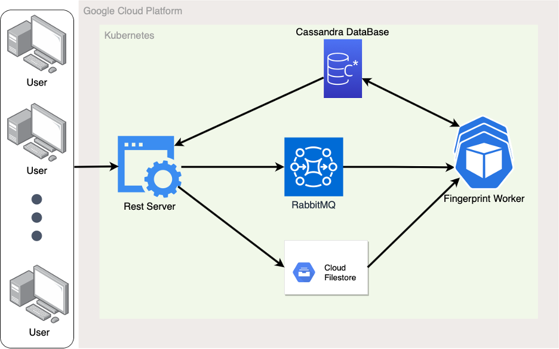

## Audio Identification Service

### Introduction
Audio identification service deployed with Kubernetes. This is a service for users to identify the song they heard at resturants, shopping centers and other public places but have no idea what is the name of the that song. Two public RESTful apis are offered:

- Add known music into database: Uploading the original audio file. The server will generate the fingerprint and save in database for future match.
- Identify unknown recording: Uploading the audio you recorded and want to get identified. The server will calculate its fingerprint and compare it with fingerprints in the database.

### Repoitory structure
- local: source code to deploy at local environment for testing
  - components: source code for each components
  - deploy.py: deploy the whole service
- gc: source code to deploy on Google Cloud

### Architecture
| directory | Description|
|---|---|
|cassandra| Scripts to deploy cassandra database|
| logs | Scripts to deploy logger pod|
| rest | flask REST server, client and test script|
| worker | audioID package and necessary files to deploy worker pod
| storage | yaml for deploying persistent volumn |
| rabbitmq | Message queue server to manage communication between other components|

